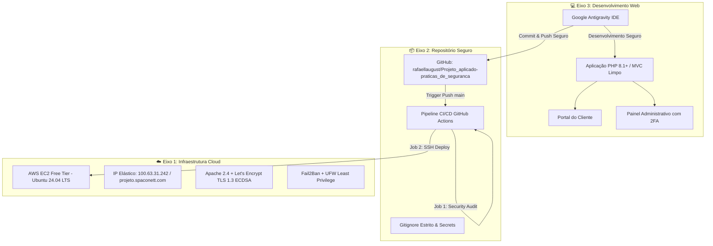
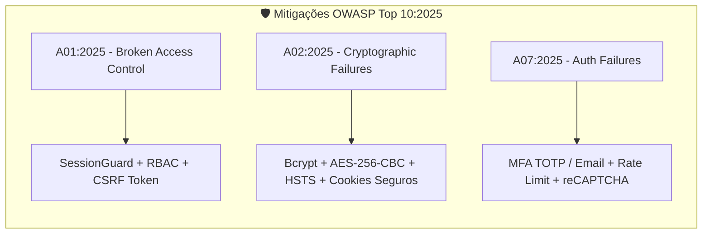
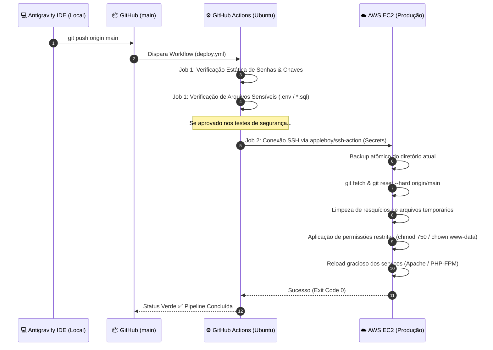

# 🌐 MikroTik Pay — Sistema de Gestão ISP & Práticas de Segurança


---

## 📌 Sumário
1. [Visão Geral do Projeto](#-visão-geral-do-projeto)
2. [Arquitetura dos Três Eixos](#-arquitetura-dos-três-eixos)
   - [Eixo 1: Infraestrutura Cloud Computing](#-eixo-1-infraestrutura-cloud-computing)
   - [Eixo 2: Repositório & Versionamento Seguro](#-eixo-2-repositório--versionamento-seguro)
   - [Eixo 3: Desenvolvimento Web & Secure by Design](#-eixo-3-desenvolvimento-web--secure-by-design)
3. [Módulos, Serviços e APIs do Sistema](#-módulos-serviços-e-apis-do-sistema)
   - [Gateway de Pagamento Pix (Mercado Pago) & SSE](#1-gateway-de-pagamento-pix-mercado-pago--sse)
   - [Integração MikroTik RouterOS API](#2-integração-mikrotik-routeros-api)
   - [Microserviço WhatsApp Notification API](#3-microserviço-whatsapp-notification-api)
   - [Serviço de Alertas Telegram](#4-serviço-de-alertas-telegram)
   - [Rotinas Automatizadas (Cron Jobs)](#5-rotinas-automatizadas-cron-jobs)
4. [Mitigações de Segurança — OWASP Top 10:2025](#-mitigações-de-segurança--owasp-top-102025)
   - [A01:2025 — Broken Access Control](#a012025--broken-access-control)
   - [A02:2025 — Cryptographic Failures](#a022025--cryptographic-failures)
   - [A07:2025 — Identification and Authentication Failures](#a072025--identification-and-authentication-failures)
   - [Proteções Adicionais de Infraestrutura](#proteções-adicionais-de-infraestrutura)
5. [Pipeline CI/CD (GitHub Actions)](#-pipeline-cicd-github-actions)
6. [Instalação e Configuração](#-instalação-e-configuração)
7. [Checklist Final de Conformidade](#-checklist-final-de-conformidade)

---

## 📖 Visão Geral do Projeto

O **MikroTik Pay** é uma plataforma de gerenciamento operacional e financeiro para Provedores de Acesso à Internet (ISP), concebida e desenvolvida como atividade prática da disciplina **Projeto Aplicado: Práticas de Mercado**.

O projeto adota rigorosamente os paradigmas **Secure by Design** e **Secure by Default**, estruturado para operar em nuvem pública gratuita, com esteira de integração e entrega contínuas (CI/CD) via GitHub Actions, autenticação multifatorial e codificação assistida por inteligência artificial no ambiente **Google Antigravity IDE**.

---

## 🏛️ Arquitetura dos Três Eixos



### ☁️ Eixo 1: Infraestrutura Cloud Computing
* **Provedor:** Amazon Web Services (AWS) — Free Tier (Instância EC2).
* **Sistema Operacional:** Ubuntu Server 24.04 LTS (Kernel Linux atualizado).
* **Endereço Público:** IP Elástico Fixo `100.63.31.242` com domínio oficial `projeto.spaconett.com`.
* **Servidor Web:** Apache 2.4.58 com módulos `mod_rewrite`, `mod_headers`, `mod_ssl` e PHP-FPM 8.1/8.3.
* **Criptografia & Certificado (HTTPS):** Certificado emitido via Certbot / Let's Encrypt (chave intermediária ECDSA `YE2`) com renovação automatizada e redirecionamento obrigatório (HTTP 301 ➔ HTTPS). Suporte a protocolos modernos TLS 1.3 com ciphersuites seguras.
* **Segurança de Borda & Acesso:** Acesso administrativo exclusivamente via chaves criptográficas SSH (porta 22) com `PasswordAuthentication no`, e serviço **Fail2Ban** com tolerância máxima de 4 tentativas incorretas e banimento por 24 horas.

### 📦 Eixo 2: Repositório & Versionamento Seguro
* **Plataforma:** GitHub — Repositório Público:  
  👉 [rafaellaugust/Projeto_aplicado-praticas_de_seguranca](https://github.com/rafaellaugust/Projeto_aplicado-praticas_de_seguranca)
* **Prevenção de Vazamentos:** Arquivo `.gitignore` abrangente bloqueando `.env`, dumps SQL (`*.sql`), logs (`*.log`), arquivos de backup compactados (`*.zip`, `*.gz`) e segredos locais.
* **Gestão de Segredos:** Todas as credenciais de produção (chaves SSH, endereços e portas) são administradas de forma sigilosa no **GitHub Secrets** (`SERVER_HOST`, `SERVER_USER`, `SSH_PRIVATE_KEY`, `SERVER_PORT`).

### 💻 Eixo 3: Desenvolvimento Web & Secure by Design
* **Codificação Assistida por IA:** Desenvolvido, auditado e refatorado através da IDE **Google Antigravity**.
* **Pilha Tecnológica:** PHP 8.1+ orientado a objetos, MySQL 8.0/MariaDB, JavaScript ES6+ e Bootstrap 5.3.
* **Estrutura Mínima Exigida:**
  1. **Tela de Login:** Autenticação separada para clientes e administradores com proteção contra força bruta.
  2. **Páginas Internas Protegidas:** Dashboards restritos após verificação criptográfica de sessão.
  3. **Logout Seguro:** Invalidação atômica de sessões e cookies no servidor.

---

## ⚡ Módulos, Serviços e APIs do Sistema

### 1. Gateway de Pagamento Pix (Mercado Pago) & SSE
O ecossistema financeiro automatizado do provedor opera com transações Pix instantâneas:
* **Criação de Cobrança (`payment/pix.php`):** Gera pagamentos Pix dinâmicos consumindo a API v1 do Mercado Pago, retornando a chave *Pix Copia e Cola* e o QR Code em base64.
* **Webhook de Notificação (`webhook/mercadopago.php`):** Endpoint receptor de callbacks do gateway. Implementa validação do payload e confirmação atômica no banco de dados, disparando a baixa da fatura e a liberação imediata da conexão do cliente no MikroTik.
* **Server-Sent Events — SSE (`payment/sse-status-payment.php`):** Substitui o polling tradicional (repetidas requisições HTTP) por um canal unidirecional de eventos em tempo real (`text/event-stream`). Quando o webhook processa o pagamento, o navegador do cliente recebe o evento instantâneo e redireciona para a tela de recibo sem refresh manual.
* **Consulta de Status (`payment/check_status.php`):** Verificador pontual de estado da transação via AJAX/JSON.

### 2. Integração MikroTik RouterOS API
Comunicação direta entre o servidor web e os roteadores de borda/concentradores (`src/RouterOSAPI.php` e `src/MikrotikAPI.php`):
* **Provisionamento de Clientes:** Criação, edição e exclusão de contas PPPoE (`/ppp/secret`) e Hotspot (`/ip/hotspot/user`).
* **Bloqueio e Desbloqueio Automatizado:** Inclusão/remoção do IP ou credencial do cliente na *Address List* de inadimplentes do firewall (`pgto_pendente`), redirecionando para a página de aviso de corte ou restaurando a navegação em milissegundos após o pagamento.
* **Idempotência Estrita:** Garantia de que execuções repetidas da rotina de sincronização não duplicam registros ou derrubam conexões ativas indevidamente (`mikrotik_payment_history`).

### 3. Microserviço WhatsApp Notification API
Mecanismo de comunicação direta com o cliente (`whatsapp-api/` e `src/WhatsAppService.php`):
* **Microserviço Baileys (Node.js):** Conexão via protocolo WebSocket do WhatsApp Web, gerenciando sessões ativas e fila de mensagens.
* **Autenticação por Bearer Token:** Protegido contra disparos não autorizados por token simétrico no cabeçalho `Authorization: Bearer <WA_TOKEN>`.
* **Notificações Automatizadas:** Disparo da fatura mensal em PDF, código Copia e Cola do Pix, comprovante de recebimento e lembretes de vencimento.

### 4. Serviço de Alertas Telegram
Canal de auditoria e monitoramento para a equipe de TI (`src/TelegramService.php`):
* Notificação em tempo real de tentativas suspeitas de invasão.
* Alerta de IPs banidos pelo Rate Limiting após 10 tentativas falhas.
* Notificação de alterações críticas de segurança (ex: ativação/desativação de 2FA por administradores).

### 5. Rotinas Automatizadas (Cron Jobs)
Scripts em lote executados via linha de comando (CLI) ou acionados via web protegidos pelo parâmetro obrigatório `?token=CRON_TOKEN`:
* **`cron/lembretes.php`:** Localiza faturas que vencem em 3 dias e agenda lembretes aos clientes.
* **`cron/disparar_whatsapp.php`:** Processa a fila de mensagens pendentes com atraso randômico (*jitter*) para evitar bloqueios no WhatsApp.
* **`cron/sincronizar_mikrotik.php`:** Varre faturas vencidas há mais de 5 dias e aplica regra de corte nos concentradores MikroTik.
* **`cron/backup.php` / `src/BackupService.php`:** Executa dumps incrementais e estruturais do MySQL, compacta em `.gz` e expurga arquivos com mais de 30 dias.

---

## 🔒 Mitigações de Segurança — OWASP Top 10:2025

O projeto implementa defesas ativas e documentadas para as vulnerabilidades do **OWASP Top 10:2025**:



### A01:2025 — Broken Access Control

* **Vulnerabilidade:** Falha na restrição de privilégios permitindo que usuários comuns acessem recursos administrativos, visualizem dados de terceiros ou forjem requisições maliciosas.
* **Como o projeto previne:**
  - **Arquitetura Default Deny:** Nenhuma página privada carrega dados sem a validação explícita de autenticação e nível de permissão (*Role-Based Access Control*).
  - **Controle de Sessão com Fingerprinting (`src/SessionGuard.php`):** A cada requisição, o sistema valida a integridade da sessão associando o hash do endereço IP do cliente e o cabeçalho `User-Agent`. Se um invasor sequestrar o identificador do cookie em outra máquina, a sessão é destruída instantaneamente.
  - **Expiração por Inatividade:** Destruição automática da sessão após 30 minutos de ociosidade.
  - **Tokens Anti-CSRF (`src/Security.php`):** Todas as ações POST/PUT/DELETE exigem token criptográfico descartável validado no servidor.

```php
// src/SessionGuard.php - Validação estrita de sessão e perfil
public static function requireAdmin(): void {
    self::start();
    if (empty($_SESSION['admin_id']) || empty($_SESSION['authenticated'])) {
        header('Location: /admin/login.php');
        exit;
    }
    self::verifyFingerprint();
    self::checkInactivity(1800); // 30 minutos
}
```

---

### A02:2025 — Cryptographic Failures

* **Vulnerabilidade:** Exposição de dados sigilosos em trânsito ou em repouso por ausência de criptografia, algoritmos obsoletos ou chaves hardcoded no código.
* **Como o projeto previne:**
  - **Zero Segredos no Código:** Credenciais de banco, tokens de API e chaves privadas residem unicamente no arquivo `.env` (fora da raiz pública e ignorado pelo Git).
  - **Hashing Robusto de Senhas:** Todas as senhas utilizam `password_hash()` com algoritmo `bcrypt` e custo computacional (`cost=12`).
  - **Criptografia Simétrica em Repouso (`src/Security.php`):** Segredos do Google Authenticator (TOTP) e credenciais de roteadores são cifrados no banco com **AES-256-CBC**, utilizando vetor de inicialização criptográfico único (`IV`) gerado por `openssl_random_pseudo_bytes()`.
  - **Flags de Segurança nos Cookies:** Os cookies de sessão recebem as flags `Secure` (somente HTTPS), `HttpOnly` (inacessíveis via JavaScript/XSS) e `SameSite=Strict` (imune a vazamentos cross-site).
  - **Criptografia em Trânsito:** HTTPS compulsório com certificado Let's Encrypt TLS 1.3 e cabeçalho `Strict-Transport-Security` (HSTS).

```php
// src/Security.php - Criptografia com AES-256-CBC
public static function encryptData(string $data): string {
    $key = hash('sha256', getenv('TOTP_ENCRYPTION_KEY'), true);
    $iv = openssl_random_pseudo_bytes(16);
    $encrypted = openssl_encrypt($data, 'aes-256-cbc', $key, OPENSSL_RAW_DATA, $iv);
    return base64_encode($iv . $encrypted);
}
```

---

### A07:2025 — Identification and Authentication Failures

* **Vulnerabilidade:** Suscetibilidade a ataques de força bruta, sequestro de credenciais, senhas fracas e ausência de múltiplos fatores de validação.
* **Como o projeto previne:**
  - **Autenticação Multifatorial (MFA/2FA):** Suporte nativo a **TOTP (RFC 6238)** compatível com Google Authenticator, Microsoft Authenticator e FreeOTP, além de envio alternativo de código OTP de 6 dígitos por E-mail.
  - **Rate Limiting Progressivo:** O sistema contabiliza as tentativas falhas por usuário e por endereço IP no banco de dados. Após 5 erros em 15 minutos, o acesso da conta é suspenso temporariamente.
  - **Banimento Automático de IP:** Após 10 erros em 24 horas, o IP é colocado em lista de bloqueio no firewall/aplicação por 24 horas (`src/Security.php`).
  - **Proteção Anti-Bot:** Integração com **Google reCAPTCHA v2** invisível na tela de login administrativo e de clientes.

```php
// src/Security.php - Rate Limiting contra Força Bruta
public static function checkRateLimit(string $ip, string $username): void {
    $db = Database::getInstance();
    $stmt = $db->prepare("SELECT COUNT(*) FROM login_attempts WHERE ip_address = ? AND attempt_time > (NOW() - INTERVAL 24 HOUR) AND success = 0");
    $stmt->execute([$ip]);
    if ((int)$stmt->fetchColumn() >= 10) {
        throw new Exception("Endereço IP temporariamente banido por 24 horas devido a excesso de tentativas falhas.");
    }
}
```

---

### Proteções Adicionais de Infraestrutura

* **Prevenção contra SQL Injection:** Uso exclusivo da camada PDO com *Prepared Statements* em 100% das consultas. Nenhuma entrada do usuário é concatenada na string SQL.
* **Prevenção contra XSS:** Sanitização em todas as saídas de dados com `htmlspecialchars($valor, ENT_QUOTES, 'UTF-8')`.
* **Hardening no Apache (`.htaccess`):**
  - Desativação de listagem de diretórios (`Options -Indexes`).
  - Bloqueio absoluto (`403 Forbidden`) para arquivos confidenciais: `.env`, `.git`, `.sql`, `.log`, `.zip`, `.gz`, `.bak` e `.md`.
  - Bloqueio de acesso direto às pastas estruturais: `/src/`, `/migrations/`, `/docs/`, `/backups/` e `/whatsapp-api/`.
  - Cabeçalhos de segurança HTTP ativos: `X-Content-Type-Options: nosniff`, `X-Frame-Options: SAMEORIGIN`, `Referrer-Policy: strict-origin-when-cross-origin` e `Permissions-Policy`.

---

## 🔄 Pipeline CI/CD (GitHub Actions)

O fluxo de implantação contínua automatiza a entrega de ponta a ponta do código:



O arquivo [.github/workflows/deploy.yml](file:///.github/workflows/deploy.yml) valida:
1. Ausência de credenciais hardcoded em arquivos PHP.
2. Bloqueio de submissão acidental de `.env`, arquivos de log e dumps SQL fora da pasta `migrations/`.
3. Execução do deploy via SSH utilizando as chaves configuradas em **Secrets**.

---

## 🚀 Instalação e Configuração

### Requisitos Mínimos
* PHP 8.1 ou superior (com extensões `pdo_mysql`, `curl`, `mbstring`, `openssl`, `bcmath`).
* Servidor Web Apache 2.4 (com `mod_rewrite` e `mod_headers`) ou Nginx.
* MySQL 8.0 ou MariaDB 10.6+.

### Passos de Instalação Local
1. Clone o repositório:
   ```bash
   git clone https://github.com/rafaellaugust/Projeto_aplicado-praticas_de_seguranca.git
   cd Projeto_aplicado-praticas_de_seguranca
   ```
2. Crie o arquivo de ambiente a partir do exemplo:
   ```bash
   cp .env.example .env
   ```
3. Preencha as credenciais do banco de dados e chaves no arquivo `.env`.
4. Importe os esquemas de migração da pasta `migrations/` em seu banco de dados:
   ```bash
   mysql -u root -p seu_banco < migrations/001_security_tables.sql
   ```
5. Inicie o servidor embutido para testes ou configure seu VirtualHost:
   ```bash
   php -S 127.0.0.1:8000
   ```

---

## ✅ Checklist Final de Conformidade

- [x] **Eixo 1 (Cloud):** Aplicação em nuvem pública (AWS EC2 Free Tier) em Ubuntu 24.04 LTS.
- [x] **Eixo 1 (Web Server & IP):** Apache 2.4 configurado no IP Elástico `100.63.31.242` e domínio `projeto.spaconett.com`.
- [x] **Eixo 1 (HTTPS & Redirecionamento):** Certificado Certbot / Let's Encrypt ativo e redirecionamento 301 de HTTP para HTTPS.
- [x] **Eixo 1 (Segurança de Servidor):** Acesso administrativo restrito a chaves SSH e proteção de força bruta via Fail2Ban (4 tentativas / 24h).
- [x] **Eixo 2 (Repositório Público):** Código-fonte versionado publicamente no GitHub.
- [x] **Eixo 2 (Vazamentos):** `.gitignore` configurado; credenciais e dumps protegidos fora do controle de versão.
- [x] **Eixo 3 (Aplicação Web):** Telas de Login, Páginas Internas protegidas e Logout implementados e funcionais.
- [x] **Eixo 3 (IA):** Desenvolvimento e auditoria de segurança realizados através do **Google Antigravity IDE**.
- [x] **Eixo 3 (OWASP Top 10:2025):** Mitigações documentadas e demonstradas no código para **A01:2025**, **A02:2025** e **A07:2025**.
- [x] **Integração CI/CD:** Pipeline de GitHub Actions configurado para deploy automático em produção após `git push origin main`.

---

## 📄 Licença e Responsabilidade

Projeto acadêmico elaborado para fins de avaliação na disciplina **Projeto Aplicado: Práticas de Mercado**.  
Desenvolvido por **Rafael Augusto** com suporte de inteligência artificial via **Google Antigravity IDE**.
