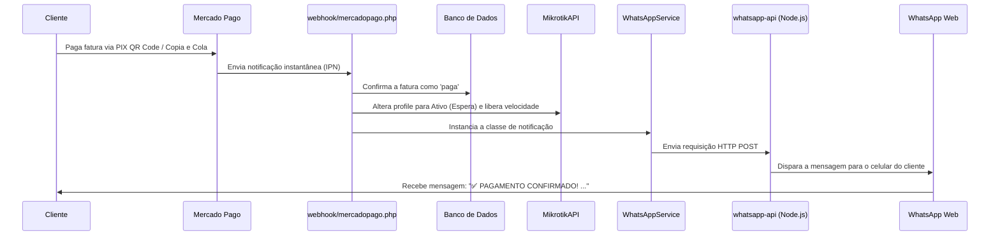

# Guia Completo de Integração do WhatsApp (WPPConnect) com o Sistema de Pagamentos

Este diretório contém a API do WhatsApp desenvolvida em Node.js usando o **WPPConnect**, que atua como uma ponte (REST API) para o seu sistema PHP. Ele se integra perfeitamente ao envio de faturas via PIX e confirmações de pagamentos automáticas.

---

## 📋 Pré-requisitos do Servidor

Dependendo do seu ambiente de hospedagem, siga os passos abaixo:

### Opção A: Servidor VPS ou Dedicado (Ubuntu/Debian)

1. **Instalar Node.js e NPM:**
   ```bash
   curl -fsSL https://deb.nodesource.com/setup_18.x | sudo -E bash -
   sudo apt-get install -y nodejs
   ```

2. **Instalar dependências de sistema do Puppeteer (Chromium):**
   Como o WPPConnect abre uma instância do WhatsApp Web em segundo plano, o Linux necessita de bibliotecas gráficas. Execute:
   ```bash
   sudo apt-get update
   sudo apt-get install -y \
     libxss1 libasound2 libatk1.0-0 libc6 libcairo2 libcups2 libdbus-1-3 \
     libexpat1 libfontconfig1 libgbm1 libgcc1 libgconf-2-4 libgdk-pixbuf2.0-0 \
     libglib2.0-0 libgtk-3-0 libnspr4 libpango-1.0-0 libpangocairo-1.0-0 \
     libstdc++6 libx11-6 libx11-xcb1 libxcb1 libxcomposite1 libcursor1 \
     libxdamage1 libxext6 libxfixes3 libxi6 libxrandr2 libxrender1 libxshmfence1 \
     libxtst6 ca-certificates fonts-liberation libnss3 lsb-release xdg-utils wget
   ```

3. **Gerenciador de Processos PM2 (Recomendado para manter rodando para sempre):**
   ```bash
   sudo npm install -g pm2
   ```

---

### Opção B: Hospedagem Compartilhada cPanel (Node.js Selector)

Se a sua hospedagem possui suporte a aplicações Node.js no cPanel:
1. Acesse o cPanel e procure por **Setup Node.js App** (Configurar Aplicativo Node.js).
2. Clique em **Create Application**.
3. Selecione a versão do Node.js (recomendável **v18 ou v20**).
4. Defina o diretório da aplicação como `whatsapp-api` e o arquivo de inicialização como `index.js`.
5. Salve e crie a aplicação.
6. O cPanel gerará um terminal virtual ou um botão de comando. Use o gerenciador do cPanel para instalar as dependências (`Run NPM Install` ou rodando `npm install` no terminal da pasta).

---

## 🛠️ Passo a Passo para Instalação e Inicialização

1. Copie a pasta `whatsapp-api` para o seu servidor.
2. Acesse a pasta através do terminal e instale as dependências:
   ```bash
   npm install
   ```
3. Edite o arquivo `config.json` para configurar os seus parâmetros de conexão:
   - `port`: A porta onde a API vai escutar (ex: `21465`).
   - `session`: Nome da sessão. Deixe como `"default"`.
   - `token`: Crie um token de segurança forte de sua preferência (ex: `"sua_chave_secreta_aqui"`).
4. Inicialize o serviço:
   * **Para testar em primeiro plano:**
     ```bash
     npm start
     ```
   * **Para rodar em segundo plano (VPS com PM2):**
     ```bash
     pm2 start index.js --name "whatsapp-api"
     pm2 save
     pm2 startup
     ```

---

## 📲 Escaneando o QR Code

1. Abra o navegador no seu computador ou celular e acesse o endereço do painel da API:
   - Se rodando localmente na VPS: `http://IP_DO_SEU_SERVIDOR:21465`
   - Se mapeou para um domínio: `https://seu-dominio-api.com`
2. O painel exibirá o **QR Code** em tempo real na tela.
3. No seu celular com o WhatsApp, vá em:
   **Aparelhos Conectados > Conectar um Aparelho**
4. Aponte a câmera para a tela para fazer a leitura.
5. A página do painel se atualizará automaticamente exibindo o status **Conectado** quando finalizar.

---

## 🔗 Vinculando a API ao Sistema de Pagamentos PHP

Agora que a API de WhatsApp está online e conectada ao seu número de telefone, configure o painel administrativo do sistema PHP para que ele saiba como encontrá-la:

1. Acesse o painel de administração do seu Provedor.
2. Vá até a página de **Configurações** (geralmente em `/admin/configuracoes.php` ou equivalente).
3. Na aba **WhatsApp / API**, preencha os campos com os mesmos valores que você configurou no `config.json`:
   - **URL da API do WhatsApp:** `http://localhost:21465` (ou o IP/Domínio externo se a API de Node estiver em outro servidor).
   - **Sessão:** `default`
   - **Token do WhatsApp:** `sua_chave_secreta_aqui` (o token que você escolheu).
4. Salve as alterações.

---

## ⚡ Integração com Sistema de Pagamentos (Mercado Pago / PIX)

A integração do WhatsApp com o sistema de pagamentos ocorre de forma automática e instantânea através do arquivo `webhook/mercadopago.php`:



### O que o sistema faz de forma 100% automática:
1. **Aviso de Fatura com PIX:**
   * Diariamente, o script em `cron/lembretes.php` é executado pelo agendador (cron job).
   * Ele localiza faturas prestes a vencer (vencimento em 3 dias) ou atrasadas.
   * Ele envia uma mensagem personalizada para o cliente contendo os dados da fatura, o link para o PDF/página de pagamento e o código **PIX Copia e Cola** formatado.
2. **Confirmação de Pagamento Instantânea:**
   * No exato momento em que o cliente paga o PIX, o Mercado Pago envia a notificação ao seu site.
   * O sistema PHP liquida a fatura, muda o plano no MikroTik e chama o Node.js para notificar no WhatsApp o cliente agradecendo pelo pagamento.

---

## 🛡️ Sistema de Auto-Cura de Criptografia e Prevenção de Falhas (E2EE)

A API conta com defesas ativas contra os problemas comuns do Baileys e hospedagens compartilhadas (cPanel/Passenger):

1. **Prevenção de "Aguardando mensagem. Essa ação pode levar alguns instantes":**
   * As mensagens enviadas e recebidas são gravadas em cache persistente em disco (`whatsapp-api/store/messages/`).
   * Se o celular do cliente ou iPhone solicitar re-envio criptográfico (*retry request*) horas ou dias depois (mesmo se o Node.js reiniciou no cPanel), a API recupera a mensagem do disco e atende à requisição imediatamente, garantindo que a mensagem apareça descriptografada no celular do cliente.
   * Uma rotina limpa automaticamente mensagens com mais de 48 horas para não ocupar espaço em disco.

2. **Auto-Cura contra "Bad MAC" e Desincronização de Sessão:**
   * Quando uma chave de contato específico perde a sincronia com o WhatsApp, a API remove cirurgicamente **apenas** o arquivo de sessão daquele contato (`session-<id>.json`).
   * O arquivo master de login (`creds.json`) é **preservado intacto**.
   * Na mensagem seguinte, o Baileys renegocia novas chaves automaticamente direto com os servidores do WhatsApp.
   * **Você não precisa apagar a pasta auth_info nem ler o QR Code novamente.**

3. **Botão de Auto-Heal no Painel Web (`/whatsapp/`):**
   * O painel administrativo possui o botão **"Reparar Criptografia (Sem Desconectar)"**.
   * Se algum contato apresentar falha de entrega ou atraso, basta clicar nele: todas as chaves transitórias são renovadas e a sessão é sincronizada mantendo o login ativo.

